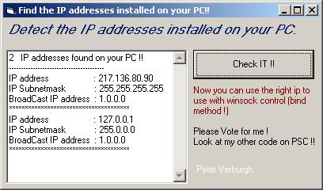



## Detect multiple protocoll  adaptors  on your PC \!\!

### Description

Detect multiple protocol adaptors ..find the IP addresses installed on your PC 

----

  

This program will detect the IP addresses installed on your pc !!  

It also detects the Subnetmask address , and Broadcast address...  

Now you can easy use the winsock control to bind to the right IP address !   

Example:  

----

if you have a networkcard installed on your pc and use a dial up for internet, then you could have the problem that if you use winsock control

that its detect the default ip (netw card) but not the IP that you use for dial up... 

You can now fill down the bind to the right IP!!

 

I've wrote this because i've an application called TCP-IP Datalook V1.3 that checks data on ports - sockets.. but and there was maybe the problem that some people could not use it because it detected the wrong ip address.. 

 

TCP - IP Datalook will be updated soon with this new part !!  

 

Please Vote for me !

 

See my other code on PSC ...

 

Peter Verburgh.
 
### More Info
 

             |
---                |---
**Submitted On**   |2001-07-24 00:28:00
**By**             |[Peter V\.](https://github.com/Planet-Source-Code/PSCIndex/blob/master/ByAuthor/peter-v.md)
**Level**          |Intermediate
**User Rating**    |4.9 (152 globes from 31 users)
**Compatibility**  |VB 4\.0 \(32\-bit\), VB 5\.0, VB 6\.0
**Category**       |[Complete Applications](https://github.com/Planet-Source-Code/PSCIndex/blob/master/ByCategory/complete-applications__1-27.md)
**World**          |[Visual Basic](https://github.com/Planet-Source-Code/PSCIndex/blob/master/ByWorld/visual-basic.md)
**Archive File**   |[Detect mul233527232001\.zip](https://github.com/Planet-Source-Code/peter-v-detect-multiple-protocoll-adaptors-on-your-pc__1-25388/archive/master.zip)

